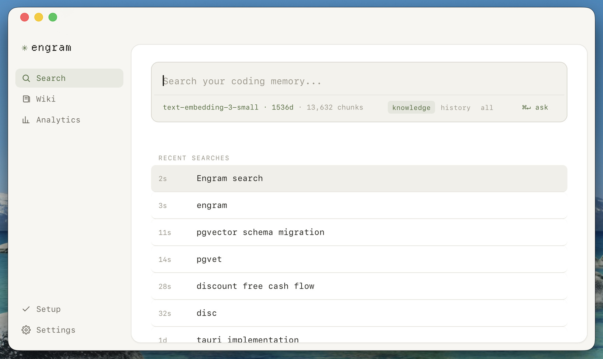
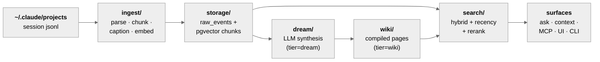

# engram

Global semantic memory for your coding sessions. Watches `~/.claude/projects`, chunks every Claude Code trajectory, embeds it, and makes your entire coding history searchable — filtered by repo, branch, and time.



## Architecture



The knowledge pyramid: L0 raw chunks/events → L1 dream chunks → L2 wiki pages → L3 `index.md`. Each layer is synthesized only from the one below, with a fingerprint short-circuit (sha256 of sorted source ids) making every layer an incremental build. Search defaults flip to the compiled tiers (MCP/UI default `synth` = wiki+dream; `--tier raw` for verbatim drill-down); the wiki→dream→raw provenance chain rides `sourceChunkIds` + the trajectory overlay.

Two design invariants:

1. **The raw log is the store of record, indexes are disposable.** Every trajectory lands in an append-only `raw_events` table before any chunking/embedding. Chunks are stamped with `chunker_version` + `embedding_model`, so re-indexing under a new model or chunker is a batch job, never a migration crisis.
2. **Never embed the same content twice.** An embedding cache keyed `(content_sha256, model)` sits in front of the OpenAI API.

## Directories

| Dir | Role |
|---|---|
| [`src/ingest/`](src/ingest/README.md) | Parse session JSONL → trajectories → chunks → embeddings; file watcher |
| [`src/storage/`](src/storage/README.md) | pgvector backend (raw events, chunks, embedding cache) + local sqlite state |
| [`src/search/`](src/search/README.md) | Query orchestration: embed query, delegate to backend |
| [`src/ask/`](src/ask/README.md) | Ask layer: retrieve top-k, one grounded LLM call, cited answer |
| [`src/dream/`](src/dream/README.md) | Dream layer: incremental LLM synthesis over raw chunks, fingerprint short-circuit |
| [`src/wiki/`](src/wiki/README.md) | Wiki layer: compile dream chunks → git-versioned markdown pages, derived pg index |
| [`src/context/`](src/context/README.md) | Context-injection layer: compose a repo-scoped session-start block from the pyramid |
| [`src/commands/`](src/commands/README.md) | CLI entrypoints (commander) |
| [`src/config/`](src/config/README.md) | `~/.engram` config loading, env overrides |
| [`src/types/`](src/types/README.md) | Shared domain types |
| [`src/ui/`](src/ui/README.md) | Local search UI (`engram ui`, search-as-you-type) |
| [`src/mcp/`](src/mcp/README.md) | MCP server (`engram mcp`) — search engram from Claude Code |

## Quick start

One command from a fresh clone:

```bash
make setup
```

Then open the app:

```bash
cd app && bun run tauri dev     # menu-bar app (Tauri)
bun run src/index.ts ui         # …or the local web UI → http://127.0.0.1:7777
```

`make setup` is idempotent (safe to re-run) and walks eight steps, each of which skips when already satisfied: preflight (bun + Docker daemon reachable), `bun install`, `docker compose up -d` + wait for Postgres, config bootstrap (writes the local pgvector `databaseUrl` into `~/.engram/config.json`; prompts once for an optional OpenAI key when interactive), first `backfill` (only if the index is empty), the `SessionStart` context hook, MCP registration (if the `claude` CLI is present), and the always-on macOS service. If Docker isn't reachable it stops and tells you to start Docker Desktop (and, for a non-default daemon, to check `docker context ls`).

Other Make targets: `make up` (just start Postgres), `make dev` (web UI), `make test`, `make typecheck`.

<details>
<summary><b>Manual setup</b> (what <code>make setup</code> automates, step by step)</summary>

```bash
bun install
docker compose up -d        # local pgvector (Docker Desktop context — see `docker context ls` if the daemon check fails)
cp .env.example .env        # set OPENAI_API_KEY (or use ENGRAM_EMBEDDING_PROVIDER=local)

bun run src/index.ts backfill
bun run src/index.ts search "what did we decide about chunking" --repo engram
bun run src/index.ts ask "what did we decide about chunking and why"   # one cited answer (needs OPENAI_API_KEY)
bun run src/index.ts dream --repo engram --dry-run   # plan a dream-layer synthesis (no cost); drop --dry-run to run it
bun run src/index.ts wiki ingest --repo engram --dry-run   # plan a wiki compile (no cost); drop --dry-run to write pages
bun run src/index.ts wiki lint       # orphans, dangling links, spelling drift, broken provenance
bun run src/index.ts ui     # local search UI at http://127.0.0.1:7777

bun run src/index.ts hooks install     # SessionStart context injection
bun run src/index.ts service install   # macOS: always-on watcher + nightly synthesis (see below)
```

</details>

Config lives at `~/.engram/config.json`; `OPENAI_API_KEY` and `ENGRAM_DATABASE_URL` env vars override it.

## Ask — answers, not results

`engram ask "<question>" [--repo --branch --since --tier(default synth) --k(default 12) --json]` gives one synthesized answer with `[n]` citations plus a cited-sources list, instead of a ranked list of hits. It reuses the same hybrid retrieval as `search`, then makes ONE grounded LLM call (`wikiModel`) that is instructed to answer only from the retrieved material and to say plainly when the material doesn't cover the question. `--json` emits `{answer, sources[], usage}`. See [`src/ask/README.md`](src/ask/README.md).

**Cost / latency:** each ask is one `wikiModel` call (gpt-5.4-mini) over ~12 retrieved snippets — roughly 6–10k prompt tokens (about a cent) and 5–20s; retrieval itself is local and free, so use `engram search` when you want raw hits at zero cost. Ask needs `OPENAI_API_KEY` and will not degrade to plain search — no key, it exits 1 and tells you to run `engram search`.

## Always-on service (macOS / launchd)

```bash
bun run src/index.ts service install     # install + start both agents (idempotent; safe to re-run after config changes)
bun run src/index.ts service status      # loaded/running state + last log lines for each agent
bun run src/index.ts service uninstall   # stop + remove both agents completely
```

`install` writes up to two LaunchAgents (plists in `~/Library/LaunchAgents/`):

| Agent | When | What it does | Log |
|---|---|---|---|
| `com.engram.watcher` | always on (`KeepAlive`) | watches `~/.claude/projects`, ingests finished sessions; when synthesis is enabled, also runs dream → wiki for that session (debounced) | `~/.engram/watcher.log` |
| `com.engram.synthesis` | daily at `synthesis.hour` (default 03:00) | `synthesis-run`: dream synthesis → wiki compile over anything new since the last run; fingerprints make an empty night free | `~/.engram/synthesis.log` |

The synthesis agent is only installed when `~/.engram/config.json` has `"synthesis": { "enabled": true, "hour": 3 }`; set `enabled: false` and re-run `service install` to remove just that agent. Manual `engram dream` / `engram wiki ingest` always work regardless of the toggle (a shared advisory lock at `~/.engram/synthesis.lock` prevents concurrent runs).

**Scope & privacy:** the watcher reads exactly one directory — `~/.claude/projects` (the session logs Claude Code already writes). No screen capture, no other files. Capture, embeddings (local MiniLM by default), storage, and search are fully local; the synthesis step is the one thing that calls out, sending session-derived text to the OpenAI API (`dreamModel`/`wikiModel` in config).

## Benchmarks

`bun run benchmarks/longmemeval.ts --dataset <longmemeval_s_cleaned.json> [--limit N]` scores engram's retrieval substrate on LongMemEval under the same raw-mode conditions MemPalace publishes (one doc per session, user turns only, fresh index per question, recall_any). Embeddings go through the pg cache, so repeat runs are free. Current numbers: R@5 0.982, NDCG@10 0.945 (vs MemPalace raw 0.966 / 0.889).

Add `--path production` to score the **real** path instead of the in-memory substrate: each question's sessions are injected via `injectDocuments` → pgvector, queried through `runSearch` restricted to an owner (`bench:<question_id>`), and sessions ranked by their best-scoring chunk (max-sim). Bench rows are deleted after each question and swept on exit; `--cleanup` purges any leftovers (`owner LIKE 'bench:%'`).

Add `--rerank` (production path only) to score with the LLM reranker enabled (rung 4). It ranks sessions by first appearance in the reranked order and prints a token/cost line; the baseline max-sim ranking is left untouched so the no-rerank numbers stay reproducible.

## MCP — use engram from Claude Code

`engram mcp` runs an [MCP](https://modelcontextprotocol.io) server over stdio exposing `engram_search`, `engram_ask`, `engram_wiki_page`, and `engram_status` (see [`src/mcp/README.md`](src/mcp/README.md)). Register it:

```bash
claude mcp add engram -- bun run /absolute/path/to/engram/src/index.ts mcp
```

## Context injection — new sessions start already knowing

`engram context` emits a compact markdown block for the current repo — the most relevant wiki pages plus recent decisions/gotchas — so a fresh Claude Code session begins with what you already decided here, not a blank slate.

```bash
engram context --cwd "$PWD"        # what this repo's next session would see
engram context --repo engram --budget 800 --json   # scripted, parseable
```

It's fast (<2s, all local SQL — no LLM, no embedding model load), deterministic (same input → byte-identical output), and **silent-empty**: a repo engram has no knowledge of prints nothing and exits 0, so it never injects noise. Relevance is provenance-first (wiki pages whose sources trace to this repo's sessions), with keyword name-matches appended and repo-scoped decisions/gotchas from the last 30 days. Everything is trimmed to a hard token `--budget` (default ~1500), dropping whole items — never mid-sentence.

**Wire it to session start.** `engram hooks print` emits the exact `settings.json` snippet (schema per the [official hooks docs](https://code.claude.com/docs/en/hooks)) and a how-to:

```bash
engram hooks print          # snippet + how-to
engram hooks print --json   # just the snippet, jq-clean
```

The snippet registers a `SessionStart` hook running `engram context --cwd "$CLAUDE_PROJECT_DIR"`; on exit 0 its stdout is added as session context. Merge it into **`~/.claude/settings.json`** (global, every project) or a project's **`.claude/settings.json`** (that repo only). Add `|resume|compact` to the matcher to also re-inject on resume/after compaction (usually redundant — they keep their own transcript/summary). `engram hooks print` is print-only; it never edits your settings files.

**Toggle without touching settings.json.** Injection is governed by a `contextInjection` block in `~/.engram/config.json` (same pattern as `synthesis`): `{ "enabled": false }` turns it off — the hook stays installed and prints nothing until you flip it back; `{ "budget": 800 }` sets the default token budget (the `--budget` flag still overrides per-run). Defaults: enabled, ~1500 tokens.

## MemPalace (benchmark reference)

[MemPalace](https://github.com/MemPalace/mempalace) is the published SOTA we measure against, kept as a side-by-side index over the same corpus — not an engram dependency. `scripts/setup-mempalace.sh` installs a pinned version, bootstraps the `mempalace` database on the compose Postgres, and mines `~/.claude/projects`. Search it with `mempalace search "..." --backend pgvector`.

## References

- [MemPalace](https://github.com/MemPalace/mempalace) — benchmark bar; verbatim thesis, retrieval ladder, eval conditions
- [Odysseus](https://github.com/pewdiepie-archdaemon/odysseus) — embedding fallback latch, local fastembed, 0.7/0.3 hybrid
- [LongMemEval](https://huggingface.co/datasets/xiaowu0162/longmemeval-cleaned) — eval dataset
- LLM Wiki pattern — incremental synthesis artifacts (the [dream layer](src/dream/README.md))
- Type: [Departure Mono](https://departuremono.com) (OFL)
